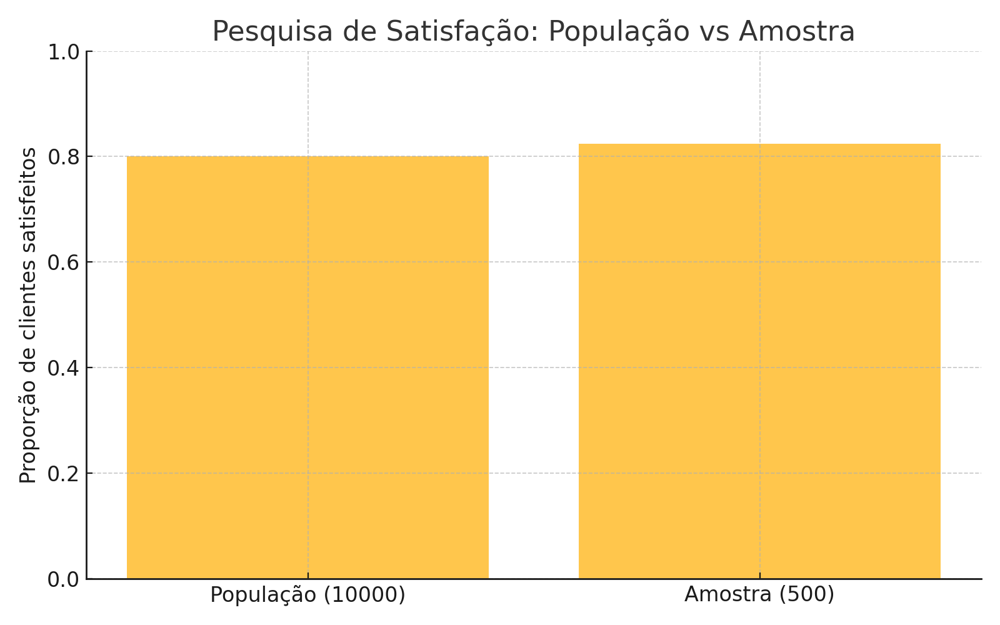
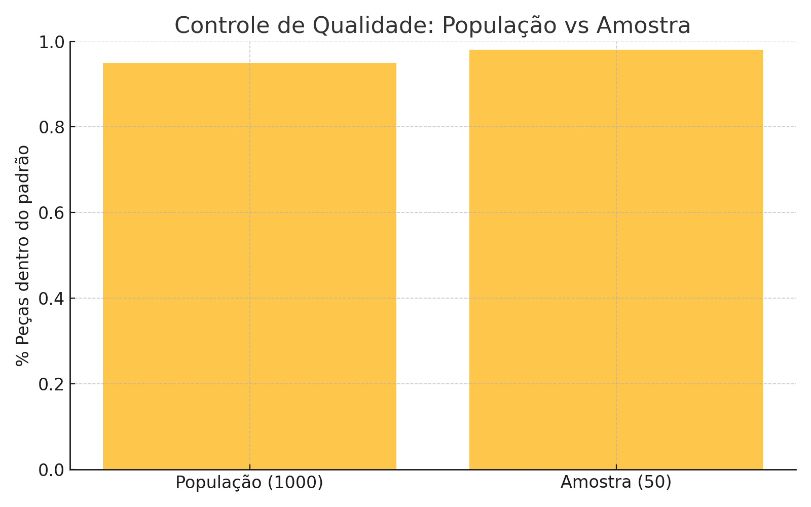
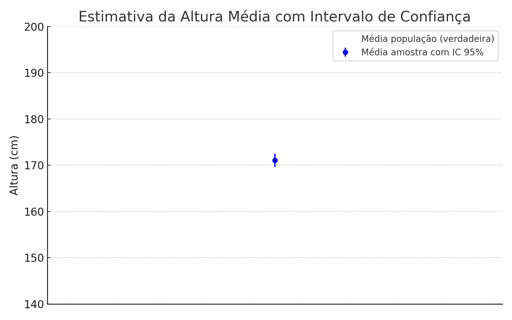

# Mini eBook: Fundamentos de Amostragem em Análise de Dados

---

## Sumário

1. Introdução  
2. O que é População?  
3. O que é Amostragem?  
4. Tamanho da Amostragem  
5. Nível de Confiança  
6. Amostragem Aleatória  
7. Importância da Amostragem Correta  
8. Exemplos Práticos  
9. Referências e Próximos Passos  

---

## 1. Introdução

Quando trabalhamos com dados, quase sempre queremos entender características de um grande grupo, chamado população. Porém, coletar dados de todos pode ser inviável ou caro. Por isso usamos a **amostragem**: estudamos uma parte representativa da população para tirar conclusões confiáveis.

---

## 2. O que é População?

A população é o conjunto completo de indivíduos ou elementos que queremos analisar.

Exemplo: Todos os clientes de uma loja, todos os funcionários de uma empresa, ou todos os sensores de uma fábrica.

---

## 3. O que é Amostragem?

A amostragem é o processo de selecionar uma parte da população para análise.

Essa parte (amostra) deve representar bem a população para que as conclusões sejam válidas.

---

## 4. Tamanho da Amostragem

O tamanho da amostra é o número de elementos que vamos analisar.

- Amostras muito pequenas podem não representar a população direito.  
- Amostras muito grandes podem ser custosas e demoradas.

Exemplo: Para uma população de 10.000 clientes, uma amostra de 400 a 500 pode ser suficiente para obter resultados confiáveis.

---

## 5. Nível de Confiança

O nível de confiança indica a certeza que temos de que a amostra reflete a população.

- Um nível de confiança de 95% significa que, em 95 de 100 vezes, os resultados da amostra estarão dentro da margem de erro esperada.  
- Quanto maior o nível de confiança, mais precisa a pesquisa, mas normalmente isso aumenta o tamanho da amostra necessária.

---

## 6. Amostragem Aleatória

A amostragem aleatória é quando todos os elementos da população têm a mesma chance de serem escolhidos.

Isso evita vieses e garante que a amostra seja justa e representativa.

Exemplo: Sortear nomes em uma lista, usar geradores de números aleatórios, etc.

---

## 7. Importância da Amostragem Correta

- Garante que as decisões baseadas nos dados sejam confiáveis.  
- Evita conclusões erradas que podem custar tempo e dinheiro.  
- Ajuda a economizar recursos evitando a necessidade de analisar toda a população.

---

## 8. Exemplos Práticos

### Exemplo 1: Pesquisa de Satisfação

Uma empresa quer saber a satisfação dos seus clientes.

- **População:** 10.000 clientes  
- **Amostra:** 500 clientes aleatórios  
- **Nível de confiança:** 95%

Veja a comparação entre a proporção de clientes satisfeitos na população e na amostra:

### Exemplo 2: Controle de Qualidade

Uma fábrica produz 1.000 peças por dia. Quer verificar se estão dentro do padrão.

- **População:** 1.000 peças  
- **Amostra:** 50 peças aleatórias

Percentual de peças dentro do padrão na população e na amostra:

### Exemplo 3: Estimativa da Altura Média com Intervalo de Confiança

Uma pesquisa mede a altura média da população com uma amostra de 200 pessoas.

- Média amostral com intervalo de confiança 95% é mostrado no gráfico, comparado à média verdadeira da população.

---

## 9. Referências e Próximos Passos

- Livros recomendados:  
  - *Estatística Aplicada* - Wilcox  
  - *Introdução à Estatística* - Montgomery e Runger  
- Cursos online: Coursera, Udemy, Khan Academy  
- Prática: aplique amostragem em seus projetos para fixar o conceito

---

# README para GitHub

## Fundamentos de Amostragem em Análise de Dados

Este mini eBook explica conceitos essenciais sobre amostragem, população, nível de confiança e amostragem aleatória, com exemplos práticos e gráficos ilustrativos. Ideal para quem está começando em análise de dados.

### Conteúdo

- Introdução à amostragem e população  
- Como determinar o tamanho da amostra  
- Nível de confiança e sua importância  
- Métodos de amostragem aleatória  
- Exemplos práticos com visualizações  

### Como usar

- Leia o conteúdo em `README.md` para entender os conceitos  
- Veja os gráficos na pasta `/images` para visualizar os exemplos  
- Use o material para estudo e aplicação em projetos de análise de dados  

---

## Imagens

- `pesquisa_satisfacao.png`  
- `controle_qualidade.png`  
- `intervalo_confianca.png`  

---

## Autor

Glauco Runha Piccolo Figlioli

---

# Fim do arquivo
